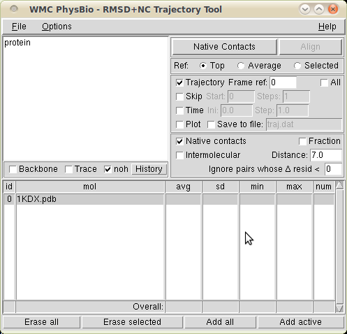

RMSD trajectory tool enhanced with native contacts
==================================================

This extension enables VMD to compute the number of native contacts in a trajectory. It is a modification of the [RMSD Trajectory Tool](http://physiology.med.cornell.edu/faculty/hweinstein/vmdplugins/rmsdtt/), of which it shares the interface.

Toni Giorgino; © Universitat Pompeu Fabra 2010

Usage
-----

Just check the box **Native contacts**. The **Distance** box allows the user to specify the cutoff for an atom pair to be considered a *contact*. If the **Fraction** box is checked, the number of contacts is normalized to 1 (i.e., a value of 1 indicates that the frame under consideration has all of the contacts present in the reference molecule).

If the **Intermolecular** box is checked, only the contacts *across* two atom selections will be counted: one element of the contacting pair has to be in one selection, the other element in the other selection. The two atom selections are specified (with the usual conventions) in two separate text boxes. *Note*: both selections are understood to come from the same VMD molecule (once from the reference and once for the target). The upper selection and lower selection texts must - each individually - yield the same number of atoms for the reference and target molecules.

If the **Δ resid** entry is set to non-zero *N*, contact pairs will only be considered if they belong to residues which are at least *N* positions apart in the peptide sequence; for example: 0 - consider all contact pairs; 1 - ignore contacts within to the the same residue; 2 - ignore contacts between neighboring monomers, and so on. The decision is taken on the basis of the *resid* VMD attribute (i.e. the one usually stored in PDB files).

The number (or fraction) of contacts will be output in the console for each selected molecule, along with their statistics over the trajectory. Plotting and saving to a text file are available as usual.

Screenshot
----------

Limitations
-----------

The computation of the number of native contacts can be fairly CPU-intensive. For this reason, the computation is disallowed if more that 10,000 contact pairs are present. In this case, you will be advised to reduce the number of atom pairs with a more restrictive selection or distance threshold. You can however disable the safety check via the *Limit native contacts* menu entry.

The patch for RMSDTT 3.0 is not well tested yet. Native contacts do not keep into account equivalent atoms.

Installation
------------

First, download the correct patch for your VMD version.

-   VMD 1.8.7 ships with RMSDTT 2.0; the corresponding patch is [here](patch).

-   VMD 1.8.8 will ship with RMSDTT 3.0; the corresponding patch is [this other file](patch-3.0).

Then, apply it as follows:

    cd {your VMD installation directory}/plugins/noarch/tcl/rmsdttX.X  # Adapt to your system
    cp rmsdtt.tcl rmsdtt.tcl.save
    patch < patch

Installation under Windows may be performed following one of the three options:

-   use a "patch" executable for windows, eg. 

-   or, follow the instructions on a linux machine, then copy the patched *rmsdtt.tcl* in the Windows machine;

-   or, install a cygwin development system, which will include the patch utility.

Citation
--------

A description of the logic used for the computation is found in section 4.2 of the paper [PLUMED-GUI: an environment for the interactive development of molecular dynamics analysis and biasing scripts](http://arxiv.org/abs/1312.3190).

Licensing
---------

Author of the patch: Toni Giorgino (contact and support: at gmail.com)

© Universitat Pompeu Fabra 2010

